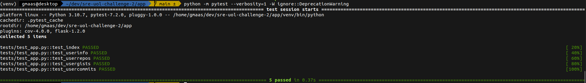

# sre-uol-challenge-2

## Sobre:

Uma API desenvolvida em Python/Flask que tem como objetivo extrair algumas informações úteis de um usuário da API pública do GitHub.

Foi um desafio proposto, detalhes neste repositório: https://github.com/sre-team/challenge

Links importantes:

[Helm chart no Artifact Hub](https://artifacthub.io/packages/helm/gmaas-github-api/gmaas-github-api?modal=install)

[Imagem Docker no Docker Hub](https://hub.docker.com/r/gmaas2/github-api/tags)

 

## Instalando e rodando a aplicação:
### Helm/k8s:

Adicione o repositório:

`helm repo add gmaas-github-api https://guilhermemaas.github.io/gmaas-github-api/charts`

Instale o chart:

`helm install my-gmaas-github-api gmaas-github-api/gmaas-github-api --version 1.0.16`

Para acessar a aplicação localmente rode o comando abaixo:

`kubectl port-forward svc/my-gmaas-github-api 5000:5000`

A aplicação estará disponível localmente na porta 5000. Você pode começar acessando a página de documentação(swagger) e fazer alguns testes para entender como a API funciona:

http://localhost:5000/apidocs

Na raíz do projeto existe um arquivo contendo uma collection do Insomnia com exemplos de cada endpoint.

Caso queira desinstalar a aplicação:

`helm uninstall my-gmaas-github-api`

### Instalação manual com Helm

Estando no diretório raíz do projeto (Nesse caso não é necessário nem adicionar, nem atualizar os repositórios helm locais):

`cd k8s && helm install --debug gmaas-github-api ./github_api/`

### Docker:

Clone o repositório:

`git clone https://github.com/guilhermemaas/sre-uol-challenge-2.git`

Utilize o docker-compose para subir a aplicação:

`cd sre-uol-challenge-2.git && docker-compose up -d`

Da mesma maneira, a aplicação estará disponível localmente na porta 5000, e a documentação nesta url http://localhost:5000/apidocs.

Caso queira desinstalar:

`docker-compose down`

 

## Documentação:

Swagger: http://localhost:5000/apidocs

    

 
Insomnia:

    

Detalhes sobre os métodos da API:

| Método HTTP | Endpoint | Descrição | Informações retornadas |
| ----------- | ----------- | ----------- | ----------- |
| GET | /user/{username}/info | Retorna um resumo de informações referentes a um usuário do GitHub | Login do usuário, Nome do usuário, E-mail do usuário, Bio, URL para o avatar do usuário, Quantidade de repositórios públicos, Quantidade de gists públicos, Quantidade de usuários seguidores, Quantidade de usuários que está seguindo, Data de criação da conta |
| GET | /user/{username}/repos | etorna informações referentes aos repositórios públicos de um usuário do GitHub |  Nome do repositório, ID do repositório, Nome completo do repositório, Descrição do repositório, Login do owner/dono do repositório, URL git do repositório, URL ssh do repositório, URL com listagem de commits no repositório, Data de criação, Último push/alteração, Branch default/padrão, Número de Issues em aberto |
| GET | /user/{username}/gists | Retorna informações referentes aos gists de um usuário do GitHub |  ID do gist, URL do gist, Arquivo(s), Owner/Dono do gist, Data/Hora de criação, Data/Hora de última atualização |
| GET | /user/{username}/commits | Retorna informações referentes aos últimos commits/contribuições de um usuário no GitHub |  ID do evento, ID do repositório, Nome do repositório, URL do repositório, URL do commit, Mensagem do commit, Autor do commit, Data/Hora do Push |
| GET | /metrics | Retorna métricas em tempo de execução para monitoramento(Prometheus) | python_gc_objects_collected_total, python_gc_objects_uncollectable_total, python_gc_collections_total, python_info, process_virtual_memory_bytes, process_resident_memory_bytes, process_start_time_seconds, process_cpu_seconds_total, process_open_fds, process_max_fds, flask_exporter_info, flask_http_request_duration_seconds_bucket, flask_http_request_duration_seconds_created, flask_http_request_total, flask_http_request_created, flask_http_request_exceptions_total |
| GET | /health | Retorna um status se a aplicação está "saudável" | Caso esteja tudo ok, retornará o status HTTP 200 e uma mensagem "Healthy" |
| GET | /read | Retorna um status se a aplicação está pronta para receber requisições | Caso esteja tudo ok, retornará o status HTTP 200 |

 

## Pipeline:

O build da aplicação ocorre de forma automática através do GitHub Actions toda vez que um novo código é adicionado. Os detalhes dos últimos builds podem ser visualizados neste [link](https://github.com/guilhermemaas/sre-uol-challenge-2/actions). Etapas atuais de CI:

1. Testes unitários: Utilizando o PyTest, os casos de teste são executados e a pipeline pode "quebrar" caso algum cenário não esteja de acordo.
2. Verificação de Cobertura dos testes: Utilizando o Coverage, uma verificação de percentual de cobertura do código é realizada e o pipeline ser interrompida caso essa cobertura não atinha o esperado. Tendo processo similar ao Quality Gate do SonarQube.
3. Imagem Docker: Utilizando o Dockerfile do diretório "app", uma imagem docker é construída e enviada para o DockerHub.
4. Helm chart: Por fim, com as etapas anteriores concluídas, um pacote Helm é gerado e enviado para outro repositório git, e o pacote é publicado no ArtifactHUB.

    

Caminho do arquivo .yaml da pipeline: 
[.github/workflows/main.yml](https://github.com/guilhermemaas/sre-uol-challenge-2/blob/main/.github/workflows/main.yml)

 

## Monitoramento:

A aplicação possui um endpoint de "Healthcheck" /health que retorna um status da aplicação para a plataforma de orquestração. Além disso, um segundo endpoint /metrics (Utilizando um Flask exporter), que tem a capacidade de exportar métricas de performance em tempo de execução para o Prometheus, conforme exemplo abaixo:

    

 
Tendo em mãos estas métricas podemos realizar consultas utilizando a linguagem "PromQL" diretamente no Prometheus e posteriormente criar alertas que podem ser enviadas por e-mail, whatsapp, discord, teams entre outros através do Alert Manager. 

Abaixo um exemplo de PromQL para buscar o tempo médio de resposta das requisições que finalizaram com sucesso em nossa API:

    

 
Alguns exemplos de consultas PromQL em cima dos dados de métricas da nossa API:

Erros por segundo (últimos 30 seg.) - Número de falhas (<> HTTP 200) por segundo:

`sum(rate(flask_http_request_duration_seconds_count{status!="200"}[30s]))`

Requests por segundo (últimos 30 seg.) - Número de sucessos que o Flask serviu por segundo:

`rate(flask_http_request_duration_seconds_count{status="200"}[30s])`

Tempo médio de resposta (últimos 30 seg.) - Tempo médio de resposta das requisições, tendo como base requests com sucesso:

`rate(flask_http_request_duration_seconds_sum{status="200"}[30s])/rate(flask_http_request_duration_seconds_count{status="200"}[30s])`

Caso queira fazer uma simulação local, rodando alguns requests por algum tempo, execute o comando abaixo:

`while true; do curl http://localhost:5000/apidocs; sleep 0.5; done;`

 

## Desenvolvimento:

Primeiramente, clone o repositório localmente:

`git clone https://github.com/guilhermemaas/sre-uol-challenge-2.git && cd sre-uol-challenge-2/app`

Crie um venv Python para instalar de forma isolada as dependências com o pip:

`python -m venv venv`

Ative o Ambiente virtual:

`source venv/bin/activate`

Instale as dependências do arquivo requirements.txt:

`pip install requirements.txt`

Para rodas os testes de unidade com Pytest:

`python -m pytest --verbosity=1`

Exemplo:

    

Para verificar o percentual de cobertura dos testes:

`coverage run -m pytest -W ignore::DeprecationWarning && coverage report --omit=tests/conftest.py,tests/test_app.py`

Exemplo:

    

Para rodar a aplicação em ambiente local em modo debug:

`export GITHUB_API_LOG_LEVEL=DEBUG`

`python app/app.py`

A partir desse momento a aplicação estará disponível em localhost:5000 e no console serão logadas mensagem do sistema, mensagens de erro, e detalhes dos requests.

Para rodar o docker-compose já buildando uma nova imagem:

`cd sre-uol-challenge-2 && docker-compose up -d`